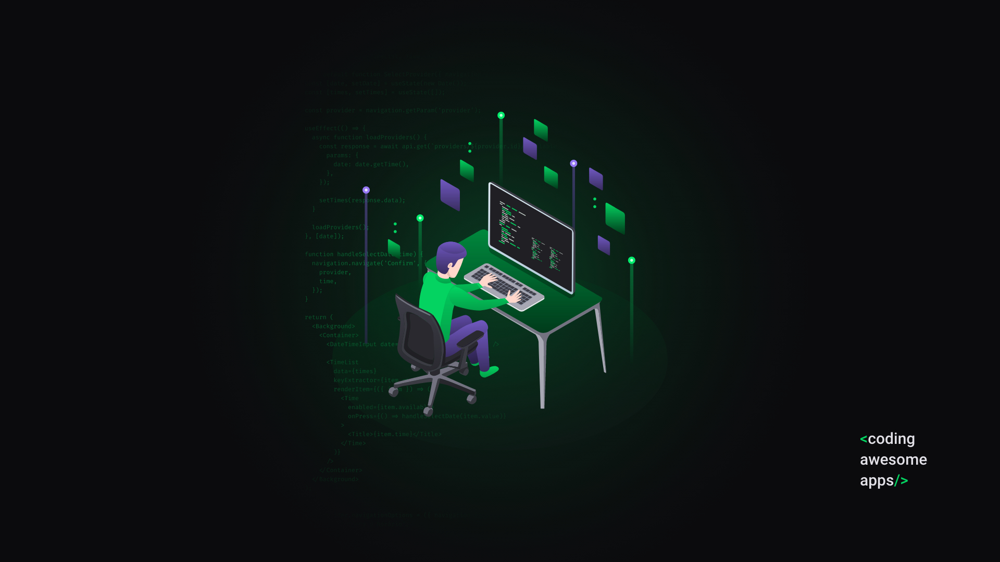

    

 

    23/03/20 - 27/03/20

<h1 align="center">
    Semana Omnistack 11
</h1>

<h2 align="center">
    Be the Hero
</h2>

Aplicação tem o objetivo de intermediar o contato de ONG's que auxiliam os animais com as pessoas que quiserem ajudá-las financeiramente.

## Empresa

[Rocketseat](https://rocketseat.com.br/) - [Prof. Diego Fernandes](https://www.linkedin.com/in/diego-schell-fernandes/)

## Datas

- [x] 23/03 - Conhecendo a OmniStack
- [ ] 24/03 - Criando a base da aplicação
- [ ] 25/03 - Construindo a interface web
- [ ] 26/03 - Desenvolvendo o app mobile
- [ ] 27/03 - Funcionalidades avançadas

<h2 align="center">
    Tecnologias
</h2>

### Back-end 🚧 (Em construção)

- [Node](https://nodejs.org/en/)
- [API RESTful](https://www.iset.com.br/blog/o-que-e-api-restful-entenda-aqui/)
- [Express](https://expressjs.com/pt-br/) - Framework
- [SQLite](https://www.sqlite.org/index.html) - Banco de dados relacional
- [KNEX.js](http://knexjs.org/) - Query Builder
- [Nodemon](https://nodemon.io/)
- [CORS]()

### Front-end 🚧 (Em construção)

- [React](https://pt-br.reactjs.org/) - Web
- [React Native](https://reactnative.dev/) - Mobile

--------

## Licença

MIT © [José Guilherme Paro Monteiro Tomaine](https://www.linkedin.com/in/jos%C3%A9-guilherme-paro-monteiro-tomaine-03540265/)
