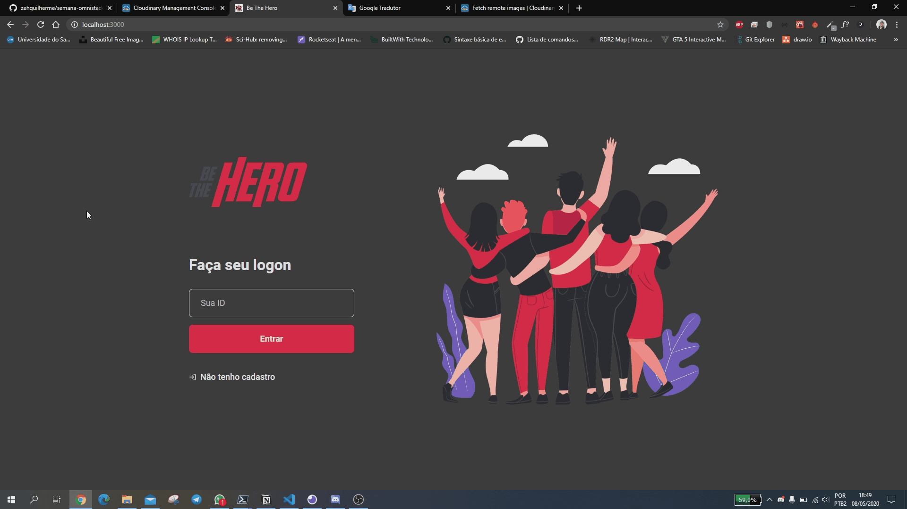

    

 

    23/03/20 - 27/03/20

<h1 align="center">
    Semana Omnistack 11
</h1>

<h2 align="center">
    
</h2>

<h4 align="center">
  A aplicação tem o objetivo de intermediar o contato de ONG's que auxiliam os animais com as pessoas que quiserem ajudá-las financeiramente.
</h4>

  
  
  
  
  

    <a href="#-empresa">Empresa</a>&nbsp;&nbsp;&nbsp;|&nbsp;&nbsp;&nbsp;
    <a href="#-datas">Datas</a>&nbsp;&nbsp;&nbsp;|&nbsp;&nbsp;&nbsp;
    <a href="#-anotações">Anotações</a>&nbsp;&nbsp;&nbsp;|&nbsp;&nbsp;&nbsp;
    <a href="#-preview">Preview</a>&nbsp;&nbsp;&nbsp;|&nbsp;&nbsp;&nbsp;
    <a href="#-gerenciador-de-pacotes">Gerenciador de pacotes</a>&nbsp;&nbsp;&nbsp;|&nbsp;&nbsp;&nbsp;
    <a href="#-utilização">Utilização</a>&nbsp;&nbsp;&nbsp;|&nbsp;&nbsp;&nbsp;
    <a href="#-tecnologias">Tecnologias</a>&nbsp;&nbsp;&nbsp;|&nbsp;&nbsp;&nbsp;
    <a href="#-como-contribuir">Como contribuir</a>&nbsp;&nbsp;&nbsp;|&nbsp;&nbsp;&nbsp;
    <a href="#-licensa">Licensa</a>

## 🏢 Empresa

[Rocketseat](https://rocketseat.com.br/) - [Prof. Diego Fernandes](https://www.linkedin.com/in/diego-schell-fernandes/)

## 📅 Datas

- [x] 23/03 - Conhecendo a OmniStack
- [x] 24/03 - Criando a base da aplicação
- [x] 25/03 - Construindo a interface web
- [x] 26/03 - Desenvolvendo o app mobile
- [x] 27/03 - Funcionalidades avançadas

## ✏ Anotações

- [Notion](https://www.notion.so/Semana-Omnistack-11-fdb2b9b8cc6b4fe3a4866e6de082b4c8)

## 👁 Preview

#### Para alterar entre os modos escuro e claro é necessário manualmente realizar essa mudança no sistema operacional (seja windows, linux, macOS ou mobile).

- Front-end

  <h4>Modo escuro<h4>

  

  <h4>Modo claro<h4>

  

- Mobile

  <h4>Modo Escuro</h4>

  

  <h4>Modo Claro</h4>

  

## 📦 Gerenciador de pacotes

Pode-se utilizar:

- [npm](https://www.npmjs.com/)

  ou

- [Yarn](https://yarnpkg.com/)

## 🎮 Utilização

- Front-end: entre na pasta `frontend` através do comando no terminal `cd frontend` e após isso digite `yarn start` ou `npm start`.

- Back-end: entre na pasta `backend` através do comando no terminal `cd backend` e após isso digite `yarn start` ou `npm start`.

- Mobile: entre na pasta `mobile` através do comando no terminal `cd mobile` e após isso digite `yarn start` ou `npm start`.
  - Instale no seu celular Android ou IOS o aplicativo `Expo` e escaneie o QR code que aparece na tela.
  - [Google Play](https://play.google.com/store/apps/details?id=host.exp.exponent)
  - [App Store](https://apps.apple.com/br/app/expo-client/id982107779) 🍎

## 💻 Tecnologias

  
Back-end

- [Node](https://nodejs.org/en/)
- [API RESTful](https://www.iset.com.br/blog/o-que-e-api-restful-entenda-aqui/)
- [Express](https://expressjs.com/pt-br/) - Framework
- [SQLite](https://www.sqlite.org/index.html) - Banco de dados relacional
- [KNEX.js](http://knexjs.org/) - Query Builder
- [Nodemon](https://nodemon.io/)
- [CORS](https://enable-cors.org/)
- [Celebrate](https://github.com/arb/celebrate) - Validação
- [Jest](https://jestjs.io/) - Framework para a realização de testes
- [Supertest](https://github.com/visionmedia/supertest) - Biblioteca para chamadas a API (testes)

  
Front-end

- [React](https://pt-br.reactjs.org/)
  - React Icons - Pacote que contém todos os ícones utilizados no React
    - [Feather icons](https://feathericons.com/)

  - Rotas da aplicação
    - React router dom

- [Axios](https://www.npmjs.com/package/axios) - Cliente HTTP
- [Jest](https://jestjs.io/) - Framework para a realização de testes

  
Mobile

- [React Native](https://reactnative.dev/)
- [Flexbox](https://css-tricks.com/snippets/css/a-guide-to-flexbox/)
- [Expo](https://expo.io/)
  - [MailComposer](https://docs.expo.io/versions/latest/sdk/mail-composer/) - Funcionalidade de e-mail
- [Axios](https://www.npmjs.com/package/axios) - Cliente HTTP
- [Jest](https://jestjs.io/) - Framework para a realização de testes

## 🤔 Como contribuir

1. Faça um fork desse repositório;
2. Crie uma branch com a sua feature: `git checkout -b minha-feature`;
3. Faça commit das suas alterações: `git commit -m 'feat: Minha nova feature'`;
4. Faça push para a sua branch: `git push origin minha-feature`;
5. Crie um pull request;
6. Depois que o merge da sua pull request for feito, você pode deletar a sua branch.

## 📝 Licensa

Este projeto está sob a licensa MIT. Veja a [licensa](LICENSE) para mais informações.

---

Feito com 💟 por José Guilherme Paro Monteiro Tomaine 👋 [Fale comigo!](https://www.linkedin.com/in/jos%C3%A9-guilherme-paro-monteiro-tomaine/)
